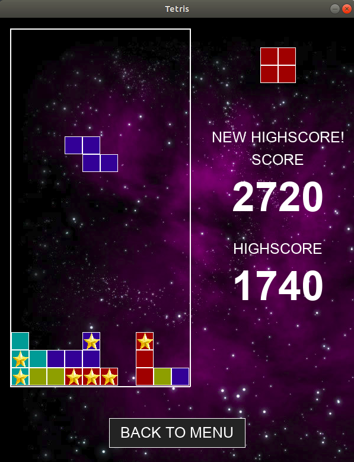
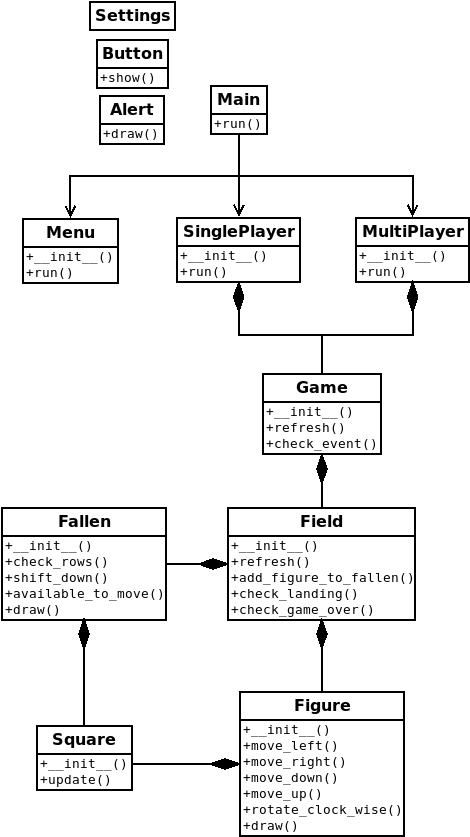

#Tetris

This is my version of Tetris game app.

PyGame library is used in the project, so you have to download it. 
Here are some instructions.

Windows:

	- install python (https://www.python.org/downloads/release/python-373/)
	- run installers/windows.bat to install pygame
	- run run.bat to run the game

Linux:

	- run installers/linux.sh to install python and pygame
	- run run.sh to run the game

Mac:

	- run installers/mac.sh to install python and pygame
	- run run.sh to run the game

Screenshot:

 

Class diagram:

 
